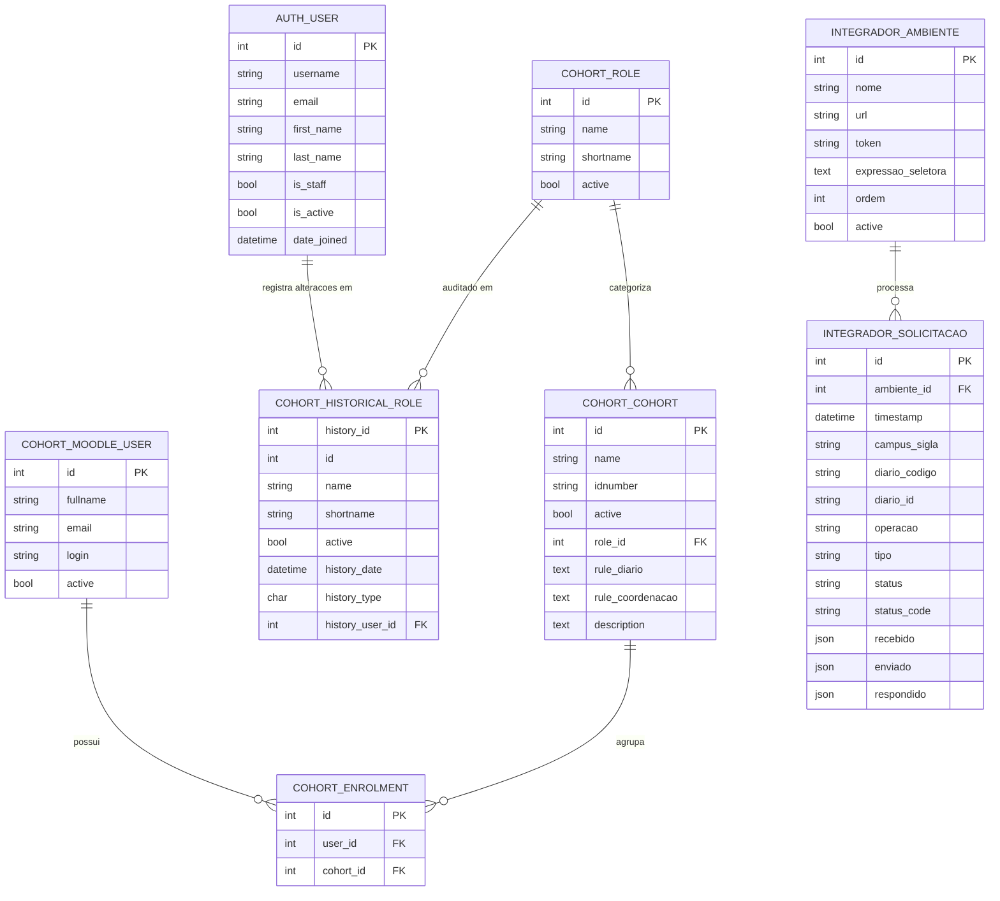
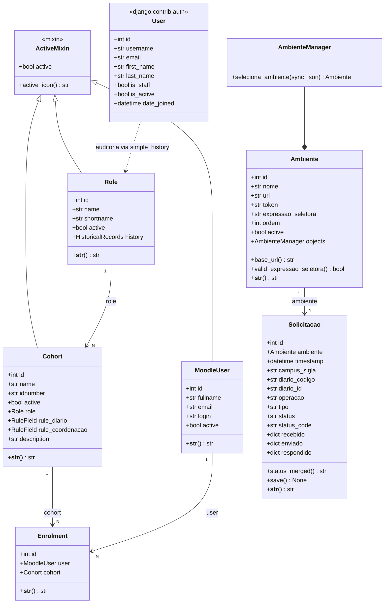

# Modelos de dados — Integrador AVA

Este documento descreve os modelos de dados dos apps `cohort`, `integrador` e `django.contrib.auth`.

---

## App `integrador`

### `Ambiente`

Representa uma instância de Moodle de destino. O Integrador pode ser configurado para
rotear requisições para diferentes Moodles com base em regras avaliadas sobre o payload
recebido.

#### Campos

| Campo                | Tipo              | Obrigatório | Descrição                                                                                     |
|----------------------|-------------------|-------------|-----------------------------------------------------------------------------------------------|
| `nome`               | `CharField(255)`  | Sim         | Nome descritivo do ambiente (ex.: `Moodle Produção ZL`)                                       |
| `url`                | `URLField(255)`   | Sim         | URL base do Moodle, sem barra final (ex.: `https://ava.ifrn.edu.br`)                          |
| `token`              | `CharField(255)`  | Sim         | Token de autenticação configurado no plugin Moodle                                            |
| `expressao_seletora` | `TextField(2550)` | Sim         | Expressão [`rule_engine`](https://zerosteiner.github.io/rule-engine/) para seleção do ambiente |
| `ordem`              | `IntegerField`    | Sim         | Prioridade de seleção (menor valor = maior prioridade). Default: `0`                          |
| `active`             | `BooleanField`    | Sim         | Se o ambiente está ativo. Default: `True`                                                     |

<details>
  <summary>Ver mais</summary>

#### Ordenação padrão

`["ordem", "id"]`

#### Propriedade `base_url`

Retorna a URL base do ambiente sem barra final, normalizada para uso nos brokers.

#### Propriedade `valid_expressao_seletora`

Indica se a `expressao_seletora` é uma expressão `rule_engine` válida.

#### Manager `AmbienteManager.seleciona_ambiente(sync_json)`

Percorre os ambientes ativos em ordem crescente de `ordem` e retorna o primeiro cujo
`expressao_seletora` corresponda ao `sync_json`. Retorna `None` se não houver correspondência.

```python
# Exemplo de uso
ambiente = Ambiente.objects.seleciona_ambiente({"campus": {"sigla": "ZL"}})
```

#### `expressao_seletora` — sintaxe

A expressão usa a biblioteca [`rule_engine`](https://zerosteiner.github.io/rule-engine/),
avaliada sobre o JSON recebido na requisição.

| Exemplo                          | Quando o ambiente é selecionado                |
|----------------------------------|------------------------------------------------|
| `campus.sigla == "ZL"`           | Quando o campus no payload tiver sigla `"ZL"` |
| `campus.sigla in ["ZL", "CE"]`   | Quando a sigla for `"ZL"` ou `"CE"`           |
| `1 == 1`                         | Sempre (funciona como catch-all)               |

> **Atenção:** a expressão é avaliada sobre o payload recebido inteiro. Se referir a um campo
> que não existe no JSON, a avaliação lança exceção e o ambiente é ignorado.

#### Exemplo de registro

| Campo                | Valor                            |
|----------------------|----------------------------------|
| `nome`               | `Moodle Produção ZL`             |
| `url`                | `https://ava.zl.ifrn.edu.br`    |
| `token`              | `(segredo)`                      |
| `expressao_seletora` | `campus.sigla == "ZL"`           |
| `ordem`              | `1`                              |
| `active`             | `True`                           |

</details>

---

### `Solicitacao`

Registra cada requisição de integração recebida pelo Integrador: o payload recebido do SGA,
o payload enviado ao Moodle e a resposta obtida. Funciona como log auditável de todas as
operações.

#### Campos

| Campo          | Tipo                     | Descrição                                                                  |
|----------------|--------------------------|----------------------------------------------------------------------------|
| `ambiente`     | `ForeignKey(Ambiente)`   | Ambiente selecionado automaticamente para a solicitação. `null=True`       |
| `timestamp`    | `DateTimeField`          | Data/hora de criação (auto-preenchido, indexado)                           |
| `campus_sigla` | `CharField(256)`         | Sigla do campus extraída do payload `recebido`. `null=True, blank=True`    |
| `diario_codigo`| `CharField(256)`         | Código composto `{turma}.{componente}#{diario_id}`. `null=True, blank=True`|
| `diario_id`    | `CharField(256)`         | ID do diário extraído do payload `recebido`. `null=True, blank=True`       |
| `operacao`     | `CharField(256)`         | Tipo de operação (ver `Operacao` abaixo). Default: `SYNC_UP_DIARIO`        |
| `tipo`         | `CharField(256)`         | Tipo de diário (ex.: `"regular"`, `"coordenacao"`). `null=True, blank=True`|
| `status`       | `CharField(256)`         | Status atual (ver `Status` abaixo). `null=True`                            |
| `status_code`  | `CharField(256)`         | Código HTTP da resposta do Moodle. `null=True, blank=True`                 |
| `recebido`     | `JSONField`              | JSON exatamente como recebido do SGA                                       |
| `enviado`      | `JSONField`              | JSON efetivamente enviado ao Moodle (com coortes injetadas)                |
| `respondido`   | `JSONField`              | JSON de resposta do Moodle                                                 |

<details>
  <summary>Ver mais</summary>

#### `Solicitacao.Status`

| Valor   | Label           | Código |
|---------|-----------------|--------|
| `S`     | Sucesso         | `S`    |
| `F`     | Falha           | `F`    |
| `P`     | Processando     | `P`    |
| `None`  | Não Definido    | `None` |

#### `Solicitacao.Operacao`

| Valor         | Label                | Descrição                              |
|---------------|----------------------|----------------------------------------|
| `SUDiario`    | Sync UP: Diário      | Enviar matrícula/papéis ao Moodle      |
| `SDNotas`     | Sync DOWN: Notas     | Baixar notas do Moodle                 |

#### Ordenação padrão

`["-timestamp"]` (mais recente primeiro)

#### Método `save()`

Ao salvar, se `recebido` estiver preenchido, auto-popula automaticamente:

- `ambiente` → `Ambiente.objects.seleciona_ambiente(recebido)`
- `campus_sigla` → `recebido["campus"]["sigla"]`
- `diario_id` → `recebido["diario"]["id"]`
- `diario_codigo` → `f"{turma_codigo}.{componente_sigla}#{diario_id}"`
- `tipo` → `recebido["diario"].get("tipo", "regular")` (para `SYNC_UP_DIARIO`)

#### Propriedade `status_merged`

Retorna HTML com status e status_code combinados, usado na listagem do admin.

#### `__str__`

```
{id}={status}, {tipo}[{ambiente}]: {campus_sigla}-{diario_id}
```

</details>

---

## App `cohort`

Os modelos são definidos em `src/cohort/models.py`.

### `MoodleUser`

Representa um usuário do Moodle que pode ser vinculado a coortes. Não corresponde ao usuário Django (`auth.User`); é um espelho do usuário criado/gerenciado no Moodle.

| Campo      | Tipo              | Obrigatório | Descrição                                              |
|------------|-------------------|-------------|--------------------------------------------------------|
| `fullname` | `CharField(2560)` | Sim         | Nome completo                                          |
| `email`    | `CharField(2560)` | Sim         | E-mail                                                 |
| `login`    | `CharField(2560)` | Sim / único | Login (único)                                          |
| `active`   | `BooleanField`    | Sim         | Se `True`, o usuário é sincronizado com o Moodle       |

<details>
  <summary>Ver mais</summary>

**Mixin**: `ActiveMixin` → adiciona propriedade `active_icon` (✅ / ⛔).

**Ordenação**: `["fullname"]`

</details>

---

### `Role`

Representa uma *role* (papel) do Moodle associada a uma coorte. Possui histórico de alterações via `simple_history`.

| Campo       | Tipo             | Obrigatório | Descrição                                                  |
|-------------|------------------|-------------|------------------------------------------------------------|
| `name`      | `CharField(256)` | Sim         | Nome da coorte gerada (ex.: `ZL.CooCurso.15056`)           |
| `shortname` | `CharField(256)` | Sim         | Shortname da role (ex.: `teachercoordenadorcurso`)         |
| `active`    | `BooleanField`   | Sim         | Se a coorte deve ser sincronizada                          |

<details>
  <summary>Ver mais</summary>

**Auditoria**: `HistoricalRecords` → gera a tabela `cohort_historicalrole` com FK para `auth.User`.

**Ordenação**: `["name"]`

</details>

---

### `Cohort`

Representa uma coorte do Moodle. Contém regras `rule_engine` que determinam se um diário ou sala de coordenação pertence a esta coorte.

| Campo              | Tipo               | Obrigatório | Descrição                                                     |
|--------------------|--------------------|-------------|---------------------------------------------------------------|
| `name`             | `CharField(2560)`  | Sim / único | Nome da coorte no Moodle                                      |
| `idnumber`         | `CharField(2560)`  | Sim / único | Identificador único no Moodle                                 |
| `active`           | `BooleanField`     | Sim         | Se `True`, a coorte é visível/sincronizada                    |
| `role`             | `ForeignKey(Role)` | Sim         | Role associada (PROTECT)                                      |
| `rule_diario`      | `RuleField`        | Não         | Expressão `rule_engine` para inclusão em diários              |
| `rule_coordenacao` | `RuleField`        | Não         | Expressão `rule_engine` para inclusão em salas de coordenação |
| `description`      | `TextField`        | Não         | Descrição livre                                               |

<details>
  <summary>Ver mais</summary>

**Ordenação**: `["name"]`

</details>

---

### `Enrolment`

Registra o vínculo entre um `MoodleUser` e uma `Cohort` (matrícula na coorte).

| Campo    | Tipo                     | Descrição                    |
|----------|--------------------------|------------------------------|
| `user`   | `ForeignKey(MoodleUser)` | Usuário vinculado (PROTECT)  |
| `cohort` | `ForeignKey(Cohort)`     | Coorte de destino (PROTECT)  |

<details>
    <summary>Ver mais</summary>

**Ordenação**: `["cohort", "user"]`

</details>

---

## App `django.contrib.auth`

O Django provê o modelo `User` para autenticação e autorização no painel administrativo. Não há FK direta dos modelos de negócio para `auth.User`, mas `simple_history` registra em `cohort_historicalrole.history_user` o usuário que realizou cada alteração em `Role`.

| Campo         | Tipo            | Descrição            |
|---------------|-----------------|----------------------|
| `id`          | `AutoField`     | Chave primária       |
| `username`    | `CharField`     | Login de acesso      |
| `email`       | `EmailField`    | E-mail               |
| `first_name`  | `CharField`     | Primeiro nome        |
| `last_name`   | `CharField`     | Sobrenome            |
| `is_staff`    | `BooleanField`  | Acesso ao admin      |
| `is_active`   | `BooleanField`  | Conta ativa          |
| `date_joined` | `DateTimeField` | Data de criação      |

---

## Diagramas

### Entidade-Relacionamento



### Diagrama de classes


